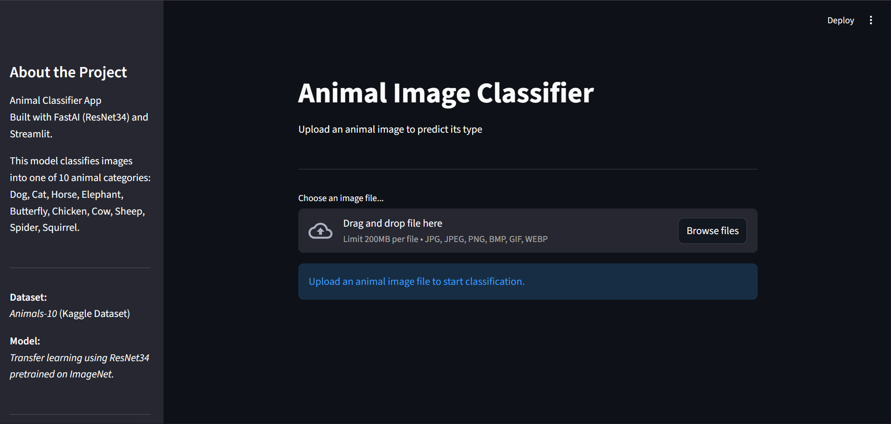
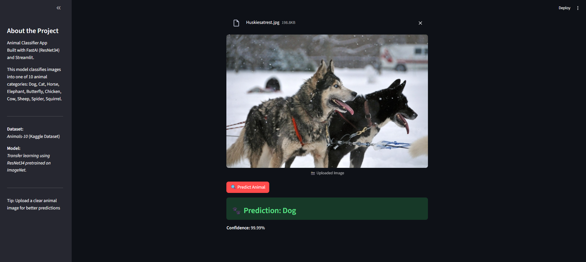
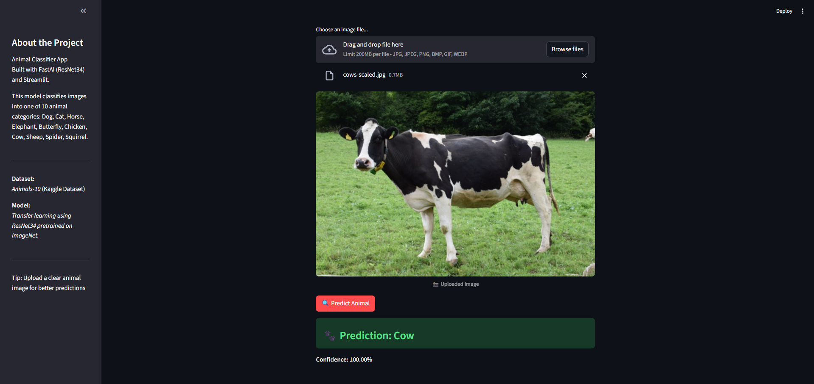

# Animal-Image-Classifier (FastAI)

This project showcases an animal image classifier web application that classifies images of animals into 10 categories using a ResNet34 model trained with FastAI. User uploads an image to get predictions with confidence scores.

Project Overview
----------------
The dataset used is Animals-10 from Kaggle, containing images of 10 animal classes: Dog, Cat, Horse, Elephant, Butterfly, Chicken, Cow, Sheep, Spider, and Squirrel. The model uses transfer learning on ResNet34 pretrained on ImageNet and achieves approximately 95–98% validation accuracy. Users can upload an image via the Streamlit app, which predicts the animal class along with confidence scores.

Workflow
-------------
-Input: Image uploaded via Streamlit interface

-Model Architecture: ResNet34 pretrained on ImageNet (transfer learning)

-Output: Predicted animal class with confidence levels

Files in Repository
-------------------
-streamlit_animal.py: Streamlit web application
  
-requirements.txt: Python packages required to be installed

Steps to run the program 
------------------------
1. Clone this repository to your local machine:

    git clone <repository_url>
    
    cd Animal-Image-Classifier

2. Download the trained model file (animal_classifier.pkl) from [Google Drive ([(https://drive.google.com/file/d/1CZwJ3Ma8EXwVSFpr31bLYKGRIhVh7lpi/view?usp=sharing)]).
   
4. Install the required packages:

     pip install -r requirements.txt
   
5. Run the Streamlit app locally:
   
     streamlit run streamlit_animal.py
   
6. Upload an animal image through the app to get predictions with confidence scores.

Screenshots
-----------
1. Webapp interface

2. Image Upload & Prediction

3. Another Example

Acknowledgments
---------------
-Dataset: Animals-10 from Kaggle

-Model: FastAI, ResNet34 pretrained on ImageNet

-Framework: Streamlit for the interactive web app

Results
-------
The web app can classify new animal images with high confidence scores (~95–99%) using only a few seconds per prediction, provided that the image is clear and falls under the type of animals the model has been trained on.

Model Details
--------------
The equation that describes the model's learning process is:

pred, pred_idx, probs = learn.predict(image)

Where,

-pred → Predicted animal class

-pred_idx → The index of the predicted class in the model’s vocabulary

-probs → Probabilities for all 10 classes

Feature Importance Analysis
---------------------------
After training, the following features were found to have the most significant influence on the predicted animal class based on probabilities:

| Animal Class | Visual Features Recognized |
| ------------ | -------------------------- |
| Dog          | Fur patterns, ears, snout  |
| Cat          | Eyes, whiskers, posture    |
| Horse        | Body shape, mane           |
| Elephant     | Trunk, large ears          |
| Butterfly    | Wing patterns              |
| Chicken      | Comb, beak, feathers       |
| Cow          | Body shape, horns, spots   |
| Sheep        | Wool texture               |
| Spider       | Legs, body shape           |
| Squirrel     | Tail, posture              |

Model Performance
-----------------
During training, the ResNet34 model achieved strong performance on the Animals-10 dataset. Over 5 epochs, the model’s validation accuracy steadily improved from 96.01% in the first epoch to 98.19% by the fifth epoch, with decreasing validation loss from 0.126 to 0.077. The training loss also dropped from 0.138 to 0.013, indicating effective learning and convergence. These metrics demonstrate that the model fits the training data very well. On new images outside the training set, the model performs accurately on clear and representative images of animals, though occasional misclassifications may occur for ambiguous or low-quality inputs.

